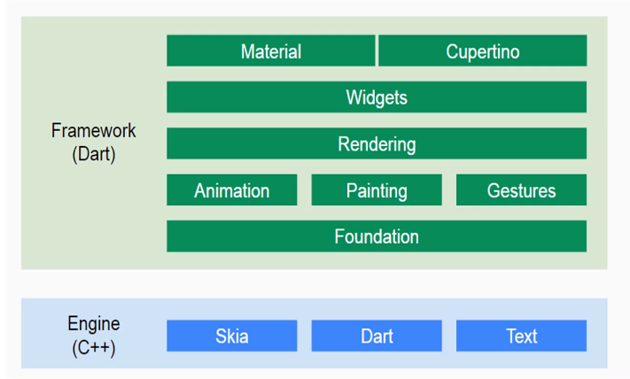

# Flutter 发展历史

## 移动端开发发展演进

- **原生时代**

  原生移动应用（APP），通常是指某一移动平台所特有的应用程序。是通过使用特定平台所支持的开发工具和语言进行开发，直接调用系统所提供的一些 SDK API。当下流行的移动操作系统中，我们使用 Java 或 Kotlin 调用 Android SDK 开发 Android 应用，或通过 Objective-C 或 Swift 调用 iOS SDK 开发可以上架 iOS应用。

  **优点**：
   1.原生开放能力，gps、蓝牙、摄像头等；
   2.性能高、体验好。
   **缺点**:
   1.特定平台开发，综合成本高，每个平台都需要开发成员。
   2.动态化能力弱，紧急问题修复或者新功能只能发版

  从开发成本的角度出发，同时开发多端的成本很高，所以就有了一个迫切的需求，能否开发一套在多个平台上运行，这样可以大大降低开发成本。 所以也推动了下一阶段的技术。

- **H5时代**

  这个阶段由于h5的兴起，主要采用 Webview 容器（广义）进行内容渲染，并借助原生代码预置用以暴露给 JavaScript 调用的一部分系统能力，而这类协议则为我们通常说的 JavaScript Bridge；这个时代的框架在 Web 与 Native 间还有比较明显的界限，大家各司其职（UI 渲染与系统功能调用）。
   甚至有一段时间大家觉得h5会替代Android原生开发，当时也出现了很多的开源框架来实现H5与底层的交互框架：PhoneGap，Cordova，Ionic，Xamarin。

  **优点**:
   1.开发成本低，简单，跨平台
   **缺点**:
   1.依旧是性能问题

- **RN时代**

  在这个阶段我们仍然用 JavaScript 开发，但绘制已经交由 Native 接管，展现在用户面前的 UI 借助的是 JavaScript VM 的解析与 Native Widgets 的组合展示。
   其实采用这种技术的不止RN，还有weex，Luaview等等目前的跨平台方案，他们的原理大同小异，只是上层采用的语言不同，中间采用的桥有差异而已，但是整个架构思想是一样的。

  **优点**：
   1.性能提升很大
   **缺点**：
   1.RN本身的成本增加。

  当人们满足于这种开发带来的便利的同时，又有了新的问题产生了，就是桥的成本太高，当涉及到频繁的跨桥调用的时候，就会出现性能问题，还有个更严重的问题就是，维护成本也很高，

  当人们认为RN能节省一半工程师的时候，其实RN的维护需要更多的工程师参与进来，
   RN的整体思想是一处学习到处使用，所以在Android和Ios的使用方式上还是有差异的，而且在开发插件的时候，还是需要开发android ios两套插件，能达到像H5一样，一处编写，到处运行还是有很大的差异的，所以除了android和ios团队外还需要一个团队维护RN，RN架构的维护成本要比android和ios的开发的难度高多了。所以成本比原来还高，还有很多Rn架构本身没有办法结局的问题，对于小团队来说简直就是噩梦。

- **Flutter时代**

  它在第三阶段的基础上，增加了一个dart虚拟机，减少了桥的交互，所以性能方面会更加优秀，还有一点就是维护上，flutter有Google维护，所以他的插件开发将会更加规范，所以理论上很容易实现跨平台代码复用的情况。

  - 2017.5 / Aplpha (v0.0.6)
  - 2018.2 / Beta 1
  - 2018.5 / Beta 3
  - 2018.6 / Preview
  - 2018.12 / Flutter Live with 1.0.0
  - 2019.5 / Flutter 1.5 (Flutter for Web 正式开启了 Flutter 的全平台 UI 框架之路)

## 什么是Flutter

> Flutter is Google’s portable UI toolkit for building beautiful, natively-compiled applications for mobile, web, and desktop from a single codebase.

Flutter是谷歌推出的便携式UI工具包，可以跨平台的构建精美的、原生体验的mobile、web、desktop应用。

Flutter可以快速使用一套代码构件原生iOS和Android应用。Flutter是开源免费的。

Flutter的github：[https://github.com/flutter/flutter](https://github.com/flutter/flutter)

Flutter特性：

- 现代响应式框架
- 快速的2D渲染引擎（60dps）
- 开发调试工具
- 内置丰富的组件

Flutter体系结构：

## 参考

- [Flutter 的发展历程](https://www.jianshu.com/p/58110c993a29)