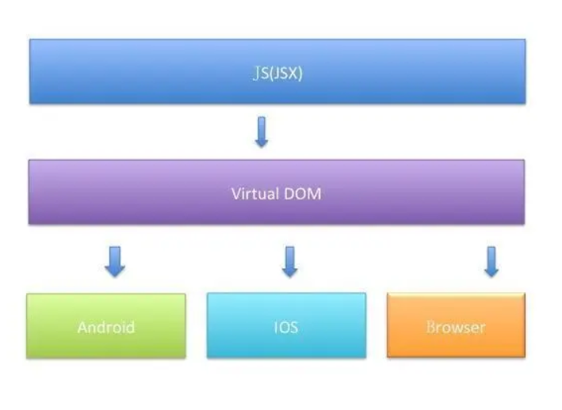
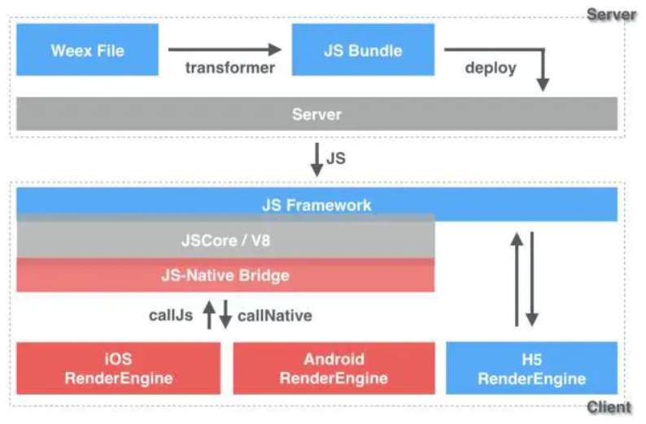

# Flutter和其他跨平台框架对比

## 跨平台技术简介

当下跨平台框架主要分为：

1. H5+原生(Cordova、Ionic、微信小程序)；
2. JavaScript开发+原生渲染(React Native、Weex、快应用)；
3. 自绘UI+原生(Flutter)。

其中：

- **React Native** （RN）

  React Native是Facebook于2015年4月开源的跨平台移动应用开发框架，是Facebook开源的JS框架React在原生移动应用平台的衍生物。React Native使用了react的设计模式，但是其UI渲染、动画效果、网络请求等均是由原生来实现的。开发者编写JS代码，通过React Native的中间层转化为原生控件，并进行操作。也就是说通过JS代码来调用原生的组件，从而实现相应的功能。

  React Native实现跨平台的功能，主要由Java、C++和Javascript三层所构成的。其中，C++实现的动态链接库（.so），作为中间适配层桥接，实现了JS端与原生端的双向通信交互。React Native会把应用的JS代码编译成一个JS文件，React Native整体框架目标就是为了解释并运行这个JS脚本文件，如果是JS扩展的API，则直接通过bridge调用native；如果是UI界面，则映射到virtual DOM这个虚拟的JS数据结构中，通过bridge传递到native，然后根据数据设置各个对应的真实native的View。

  

- **Weex**

  在Weex设计之初，开发者就考虑到，使其能够在三端（iOS、安卓和H5）上均能得到展现。在最上面的DSL，阿里一般称之为Weex文件（.we），通过Transform转换为js-bundle，再部署到服务器，这样服务端就完成了。在客户端，第一层是JS-Framework，最后是RenderRengine。

  

  如上图所示，Weex的输入是Virtual DOM，输出是native或H5 view，还原为内存中的树型数据结构，再创建view，把事件绑定在view上，设置view的基本属性。Weex Render会分三个线程，不同的线程负责不同的事情，让JS线程优先保障流畅性。

  表面上，Weex是一种客户端技术，但实际上，它串联起了从本地开发、云端部署到分发的整个链路。开发者可以在本地像编写Web页面一样先编写一个APP界面，然后通过命令行工具将之编译为一段JavaScript代码，生成一个Weex的JS bundle。与此同时，开发者可以将生成的JS bundle部署至云端，之后通过网络请求或者预下发的方式加载至用户的移动应用客户端。

  在移动应用客户端，Weex SDK会准备一个JavaScript执行环境，在用户打开一个Weex页面时，在该环境中执行相应的JS bundle，并将执行过程中产生的各种命令发送到native端，进行界面渲染、数据存储、网络通信、调用设备及用户交互响应等。如果用户希望使用浏览器访问这个界面，那么他可以在浏览器中打开一个相同的Web页面，这个页面和移动应用使用相同的页面源代码，但被编译成适合Web展示的JS Bundle，通过浏览器里的javaScript引擎及Weex SDK运行起来的。

- **Flutter**

  Flutter 是Google推出并开源的移动应用开发框架，主打跨平台、高保真、高性能。开发者可以通过Dart语言进行APP开发，只需要一套代码就可以同时构建Android和iOS应用，并且可以达到与原生应用一样的性能。Flutter还提供了丰富的组件、接口，开发者可以高效地为 Flutter添加native扩展。此外，Flutter还使用了Native引擎渲染视图，为用户提供了良好的体验。

  Flutter与用于构建移动应用程序的其它多数框架不同，因为Flutter既不使用WebView，也不使用操作系统的原生控件。相反，Flutter使用自己的高性能渲染引擎来绘制widget。这样不仅可以保证在Android和iOS的UI一致性，而且也可以避免对原生控件依赖而带来的限制和高昂的维护成本。

  同时，Flutter使用Skia作为2D引擎渲染，Skia是Google的一个2D图形处理函数库，在字型、坐标转换以及点阵图等方面都有高效而且简洁的表现。Skia是跨平台的，并提供了非常友好的API。由于Android系统已经内置了Skia，所以Flutter在打包APK时，不需要再将Skia打包到APK中，但是iOS系统并未内置Skia，所以在构建API时，必须将Skia一起打包。

## **高性能的Flutter**

Flutter程序主要有两种运行方式：静态编译与动态解释。

- 静态编译的程序在执行前，会被全部翻译为机器码，通常将这种类型称为AOT，即 “提前编译”。
- 解释执行则是一句句地边翻译边运行，通常将这种类型称为JIT，即“即时编译”。

Flutter的高性能主要靠两点来保证:

- Flutter APP采用Dart语言进行开发。当Dart在 JIT模式下时，其运行速度与 JavaScript基本持平。此外Dart支持 还AOT，当Dart在 AOT模式下事，其运行速度远超JavaScript。速度的提升对高帧率下的视图数据计算很有帮助。
- Flutter使用自己的渲染引擎来绘制UI，布局数据等由Dart语言直接控制，所以在布局过程中不需要像RN那样要在JavaScript和Native之间通信，在一些滑动和拖动的场景下具有明显优势。由于滑动和拖动往往会引起布局的变化，所以JavaScript需要不停地与Native之间同步布局信息，这和在浏览器中要JavaScript频繁操作DOM所带来的问题是相同的，都会带来比较可观的性能开销。

## **为什么Flutter会选择Dart语言？**

1. **开发效率高** Dart运行时和编译器支持Flutter的两个关键特性的组合，分别是基于JIT的快速开发周期和基于AOT的发布包。基于JIT的快速开发周期：Flutter在开发阶段，采用JIT模式，这样就避免了每次改动都需要进行编译，极大地节省了开发时间。基于AOT的发布包，Flutter在发布时可以通过AOT生成高效的ARM代码，以保证应用性能。而JavaScript则不具备这个能力。

2. **高性能** 为了实现流畅、高保真的的UI体验，Flutter必须在每个动画帧中都运行大量的代码。这意味着需要一种既能支持高性能，又能保证不丢帧的周期性暂停的语言，而Dart支持AOT，在这一点上比JavaScript更有优势。

3. **快速分配内存** Flutter框架使用函数式流，这使得它在很大程度上依赖于底层的内存分配器。

4. **类型安全** 由于Dart是类型安全的语言，支持静态类型检测，所以可以在编译前就发现一些类型的错误，并排除潜在问题。这对于前端开发者来说更具有吸引力。而JavaScript是一个弱类型语言，这也是为什么在诸多前端社区中，会有众多为JavaScript代码添加静态类型检测的扩展语言和工具。

## 参考

- [浅谈跨平台框架Flutter的优势与结构](https://www.jianshu.com/p/b8fe7afa2106)