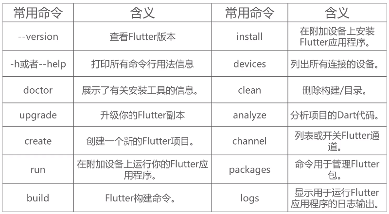

# 环境搭建

## Flutter环境搭建配置

### 系统配置要求（Windows）

要想安装和运行 Flutter，你的开发环境至少应该满足如下的需求：

- 操作系统：Windows 7 SP1 或更高的版本（64 位操作系统）。

- 磁盘空间：除安装 IDE 和一些工具之外还应有至少 400 MB 的空间。

- 工具：要让 Flutter 在你的开发环境中正常使用，依赖于以下的工具：

  - Windows PowerShell 5.0 或者更高的版本（Windows 10 中已经预装了）

  - Git for Windows 2.x，并且勾选从 Windows 命令提示符使用 Git 选项。

    如果 Windows 版的 Git 已经安装过了，那么请确保能从命令提示符或者 PowerShell 中直接执行 git 命令。

摘自：[在 Windows 操作系统上安装和配置 Flutter 开发环境](https://flutter.cn/docs/get-started/install/windows)

### 获取 Flutter SDK

#### 下载安装包

 **备忘** 请注意，类似 7-Zip 等解压工具默认情况下是不解压隐藏文件的，这可能会导致你下载的 Flutter SDK 是不完整的，请参加下一小节的说明，通过命令行方式安装。

1. 下载下面的安装包以获取最新版本 stable 的 Flutter SDK

   [flutter_windows_v1.12.13+hotfix.7-stable.zip](https://storage.flutter-io.cn/flutter_infra/releases/stable/windows/flutter_windows_v1.12.13+hotfix.7-stable.zip)

   [最新下载地址](https://flutter.cn/docs/get-started/install/windows#下载安装包)

   要查看其他发行通道和以往的版本，请参阅 [SDK 版本列表](https://flutter.cn/docs/development/tools/sdk/releases) 页面。

2. 将压缩包解压，然后把其中的 `flutter` 目录整个放在你预想的 Flutter SDK 安装目录中（比如 `C:\flutter`；请勿将该目录放在一些需要额外操作权限的目录，比如 `C:\Program Files\`）。

3. 找到 `flutter` 目录中的 **flutter_console.bat** 文件，双击执行该批处理脚本。

### 命令行方式安装

- 打开命令行窗口，cd 到你想安装 Flutter SDK 的目录，（比如 `C:\flutter`，请勿将该目录放在一些需要额外操作权限的目录，比如 `C:\Program Files\`）。
- 运行 `git clone` 命令，下面的命令是用来安装稳定构建渠道的 Flutter SDK，要升级查看其他构建渠道的 Flutter 版本，请参阅 [升级 Flutter](https://flutter.cn/docs/development/tools/sdk/upgrading)。

```
git clone -b stable https://github.com/flutter/flutter.git
```

- 定位并打开 `flutter` 的文件夹，双击运行 **flutter_console.bat** 开始安装。

步骤 1 和 2 可以被替换。如果你不想安装固定版本的安装包。 Flutter SDK 是免费且开源的，你可以从 GitHub 上的 [Flutter repo](https://github.com/flutter/flutter) 获取源代码，并根据需要更改分支或标签。

```
$ git clone https://github.com/flutter/flutter.git
```

现在你可以在控制台当中使用 Flutter 的命令了。

### 更新 path 环境变量

如果你想要在普通的 Windows 控制台中使用 Flutter 命令，那就需要按照下面的步骤来将 Flutter 的二进制文件路径加入到 `PATH` 环境变量。

- 在开始菜单的搜索功能键入“env”，然后选择 **编辑当前用户的环境变量**
- 在 **用户变量** 一栏中，检查是否有 **Path** 这个条目：
  - 如果存在，直接把 `flutter\bin` 目录的完整路径以 `;` 作为分隔加到已有的值后面。
  - 如果不存在的话，在用户环境变量中创建一个新的 `Path` 变量，然后将 `flutter\bin` 所在的完整路径作为新变量的值。

注意，你需要关闭和重新启动已经打开的各个控制台窗口，这样下次启动控制台时才能访问到刚才修改的变量。

### 运行 `flutter doctor`

在将 `Path` 变量更新后，打开一个新的控制台窗口，然后将下面的命令输入进去执行。如果它提示有任何的平台相关依赖，那么你就需要按照指示完成这些配置：

```
C:\flutter>flutter doctor
```

上述命令会检查你的现有环境，然后把检测结果以报告形式呈现出来。仔细阅读它显示的内容，检查是否有尚未安装的软件或是有其他的步骤需要完成（通常会以**粗体**呈现）。

比如：

```

        ######## ##       ##     ## ######## ######## ######## ########
        ##       ##       ##     ##    ##       ##    ##       ##     ##
        ##       ##       ##     ##    ##       ##    ##       ##     ##
        ######   ##       ##     ##    ##       ##    ######   ########
        ##       ##       ##     ##    ##       ##    ##       ##   ##
        ##       ##       ##     ##    ##       ##    ##       ##    ##
        ##       ########  #######     ##       ##    ######## ##     ##


 WELCOME to the Flutter Console.
 ===============================================================================

 Use the console below this message to interact with the "flutter" command.
 Run "flutter doctor" to check if your system is ready to run Flutter apps.
 Run "flutter create <app_name>" to create a new Flutter project.

 Run "flutter help" to see all available commands.

 Want to use an IDE to interact with Flutter? https://flutter.dev/ide-setup/

 Want to run the "flutter" command from any Command Prompt or PowerShell window?
 Add Flutter to your PATH: https://flutter.dev/setup-windows/#update-your-path

 ===============================================================================

D:\Android\FlutterSDK\flutter>flutter doctor
Downloading Material fonts...                                       1.4s
Downloading Gradle Wrapper...                                       0.6s
Downloading package sky_engine...                                   1.2s
Downloading flutter_patched_sdk tools...                            3.0s
Downloading flutter_patched_sdk_product tools...                    2.7s
Downloading windows-x64 tools...                                    5.5s
Downloading windows-x64/font-subset tools...                        3.1s
Downloading android-arm-profile/windows-x64 tools...                2.6s
Downloading android-arm-release/windows-x64 tools...                1.2s
Downloading android-arm64-profile/windows-x64 tools...              1.5s
Downloading android-arm64-release/windows-x64 tools...              1.8s
Downloading android-x64-profile/windows-x64 tools...                1.5s
Downloading android-x64-release/windows-x64 tools...                1.4s
Doctor summary (to see all details, run flutter doctor -v):
[√] Flutter (Channel master, v1.15.2-pre.28, on Microsoft Windows [Version 10.0.18363.592], locale zh-CN)
[X] Android toolchain - develop for Android devices
    X Unable to locate Android SDK.
      Install Android Studio from: https://developer.android.com/studio/index.html
      On first launch it will assist you in installing the Android SDK components.
      (or visit https://flutter.dev/setup/#android-setup for detailed instructions).
      If the Android SDK has been installed to a custom location, set ANDROID_SDK_ROOT to that location.
      You may also want to add it to your PATH environment variable.

[!] Android Studio (version 3.0)
    X Flutter plugin not installed; this adds Flutter specific functionality.
    X Dart plugin not installed; this adds Dart specific functionality.
[√] Android Studio (version 3.5)
[!] Connected device
    ! No devices available

! Doctor found issues in 3 categories.

D:\Android\FlutterSDK\flutter>
```

可以看出我有三项未通过：

- ```
  [X] Android toolchain - develop for Android devices
      X Unable to locate Android SDK.
        Install Android Studio from: https://developer.android.com/studio/index.html
        On first launch it will assist you in installing the Android SDK components.
        (or visit https://flutter.dev/setup/#android-setup for detailed instructions).
        If the Android SDK has been installed to a custom location, set ANDROID_SDK_ROOT to that location.
        You may also want to add it to your PATH environment variable.
  ```

  这条表示我需要把我本地Android SDK路径添加到环境变量中，命名为`ANDROID_SDK_ROOT`，路径指向Android SDK路径根目录。

  我们按照如上添加环境变量之后提示:

  ```
  [!] Android toolchain - develop for Android devices (Android SDK version 29.0.2)
      ! Some Android licenses not accepted.  To resolve this, run: flutter doctor --android-licenses
  ```

  可根据提示或参考[遇到问题](#遇到问题)第3条解决。

- ``` 
  [!] Android Studio (version 3.0)
      X Flutter plugin not installed; this adds Flutter specific functionality.
      X Dart plugin not installed; this adds Dart specific functionality.
  [√] Android Studio (version 3.5)
  ```

  我本地安装了两个不同版本Android Studio 3.0 和3.5，我使用的是3.5版本，所以3.0版本不通过我们不予理会。

- ```
  [!] Connected device
      ! No devices available
  ```

  这条表示我们本地没有可用设备连接，可以创建Android  或iOS虚拟机或链接真机即可。

处理完以上异常，环境就算配置完成了。

### 配置事项

- 配置国内镜像

  如果你在国内使用 Flutter，那么你可能需要找一个与官方同步的可信的镜像站点，帮助你的 Flutter 命令行工具到该镜像站点下载其所需的资源。
  你需要为此设置两个环境变量: PUB_HOSTED_URL 和 FLUTTER_STORAGE_BASE_URL，然后再运行 Flutter 命令行工具，查看[设置教程](https://flutter-io.cn/community/china)。

```
  ### Flutter 社区

  FLUTTER_STORAGE_BASE_URL: https://storage.flutter-io.cn
  PUB_HOSTED_URL: https://pub.flutter-io.cn

  ### 清华大学 TUNA 协会

  FLUTTER_STORAGE_BASE_URL: https://mirrors.tuna.tsinghua.edu.cn/flutter
  PUB_HOSTED_URL: https://mirrors.tuna.tsinghua.edu.cn/dart-pub
```
  > 注意：我们无法保证这些镜像网站得以长期维护和运行，请慎重选择一些可信的镜像网站。

  摘自：[https://flutter.cn/](https://flutter.cn/)

- 配置Gradle工具和环境变量

- 配置JDK和SDK环境，注意安装SDK时需要同意Android license

- Flutter打开很慢，需要配置以加快打开速度

  解决方法：Android Studio 安装目录下的bin目录， 找到idea.properties文件，在文件最后追加代码`disable.android.first.run=true`,然后保存。

- 配置cpu支持， 解决部分机型兼容性问题

  解决方法：根目录/android/app/build.gradle, 在android节点里面添加以下内容：

  ``` gradle
  splits {
         abi{include'x86', 'armeabi-v7a', 'x86_64'}
  }
  ```

  缺少哪个cpu支持 就加上哪个cpu。

## 常用命令行

命令行运行`flutter -h`查看帮助：

``` 
λ flutter -h
Manage your Flutter app development.
管理你的Flutter应用程序开发。

Common commands:

  flutter create <output directory>
    Create a new Flutter project in the specified directory.
    在指定的目录中创建一个新的Flutter项目。

  flutter run [options]
    Run your Flutter application on an attached device or in an emulator.
    在指定的目录中创建一个新的Flutter项目。

Usage: flutter <command> [arguments]

Global options:
-h, --help                  Print this usage information.打印此使用信息。
-v, --verbose               Noisy logging, including all shell commands executed.
                            日志记录，包括所有执行的shell命令。
                            If used with --help, shows hidden options.
                            如果与`--help`一起使用，则显示隐藏选项。

-d, --device-id             Target device id or name (prefixes allowed).
                            目标设备id或名称（允许前缀）。
    --version               Reports the version of this tool.
                            查看版本
    --suppress-analytics    Suppress analytics reporting when this command runs.
                            运行此命令时禁止显示分析报告。
    --packages              Path to your ".packages" file.
                            指定Path to your ".packages" file.
                            (required, since the current directory does not contain a ".packages"                                 file)
                            （必需，当前目录不包含“.packages”文件）

Available commands:
  analyze                  Analyze the project's Dart code.
                           分析项目的Dart代码。
  assemble                 Assemble and build flutter resources.
                           组装和构造Flutter资源。
  attach                   Attach to a running application.
                           附加到正在运行的应用程序。
  bash-completion          Output command line shell completion setup scripts.
                           输出命令行shell完成设置脚本。
  build                    Flutter build commands.
                           Flutter构建命令
  channel                  List or switch flutter channels.
                           列出或切换Flutter通道。
  clean                    Delete the build/ and .dart_tool/ directories.
                           删除build/和.dart_tool/目录。
  config                   Configure Flutter settings.
                           配置flutter设置。
  create                   Create a new Flutter project.
                           创建一个新的flutter项目。
  devices                  List all connected devices.
                           列出所有设备。
  doctor                   Show information about the installed tooling.
                           显示有关已安装工具的信息。
  drive                    Runs Flutter Driver tests for the current project.
                           为当前项目运行flutter驱动器测试。
  emulators                List, launch and create emulators.
                           列出、启动和创建模拟器。
  format                   Format one or more dart files.
                           格式化一个或多个dart文件。
  generate                 run code generators.
                           运行代码生成器。
  help                     Display help information for flutter.
                           显示flutter的帮助信息。
  install                  Install a Flutter app on an attached device.
                           在连接的设备上安装flutter应用程序。
  logs                     Show log output for running Flutter apps.
                           显示运行flutter应用程序的日志输出。
  make-host-app-editable   Moves host apps from generated directories to non-generated directories so                            that they can be edited by developers.
                           将宿主应用程序从生成的目录移动到非生成的目录，以便开发人员可以编辑它们。
  precache                 Populates the Flutter tool's cache of binary artifacts.
                           填充flutter工具的二进制工件缓存。
  pub                      Commands for managing Flutter packages.
                           管理flutter包的命令。
  run                      Run your Flutter app on an attached device.
                           在连接的设备上运行Flutter应用程序。
  screenshot               Take a screenshot from a connected device.
                           从连接的设备上截图。
  test                     Run Flutter unit tests for the current project.
                           为当前项目运行flutter单元测试。
  upgrade                  Upgrade your copy of Flutter.
                           升级你的Flutter副本。
  version                  List or switch flutter versions.
                           列出或切换flutter版本。

Run "flutter help <command>" for more information about a command.
Run "flutter help -v" for verbose help output, including less commonly used options.
```

常用命令有：




## 遇到问题

1. `flutter upgrade`出现的红色错误提示。

  如：BitsTransformer或CategoryInfo之类关键字。主要是网络原因，从网络获取依赖时出错。

2. `flutter doctor( -v)`出现的红色错误提示。

  如：BitsTransformer或CategoryInfo之类关键字。

3. `Some Android licenses not accepted.` 或 `Android licenses status unknown`错误提示。

  解决：命令行输入`flutter doctor --android-licenses`，根据提示输入`y`即可。


## 参考

- [在 Windows 操作系统上安装和配置 Flutter 开发环境](https://flutter.cn/docs/get-started/install/windows)