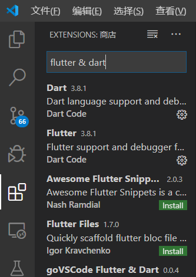
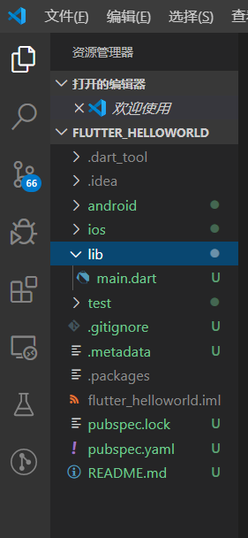
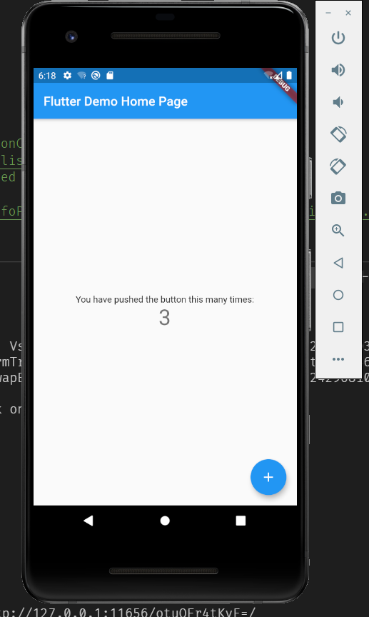
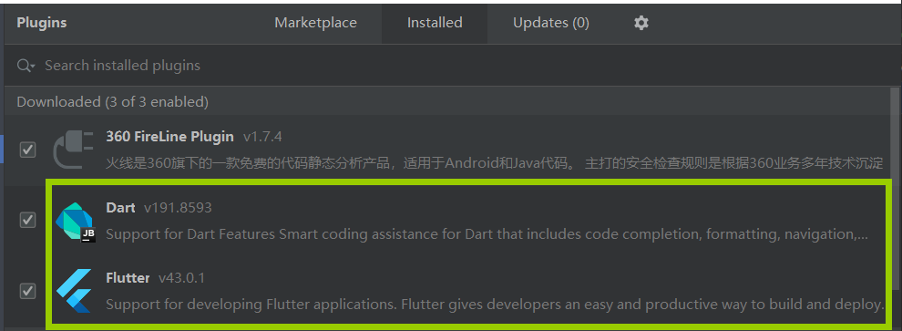
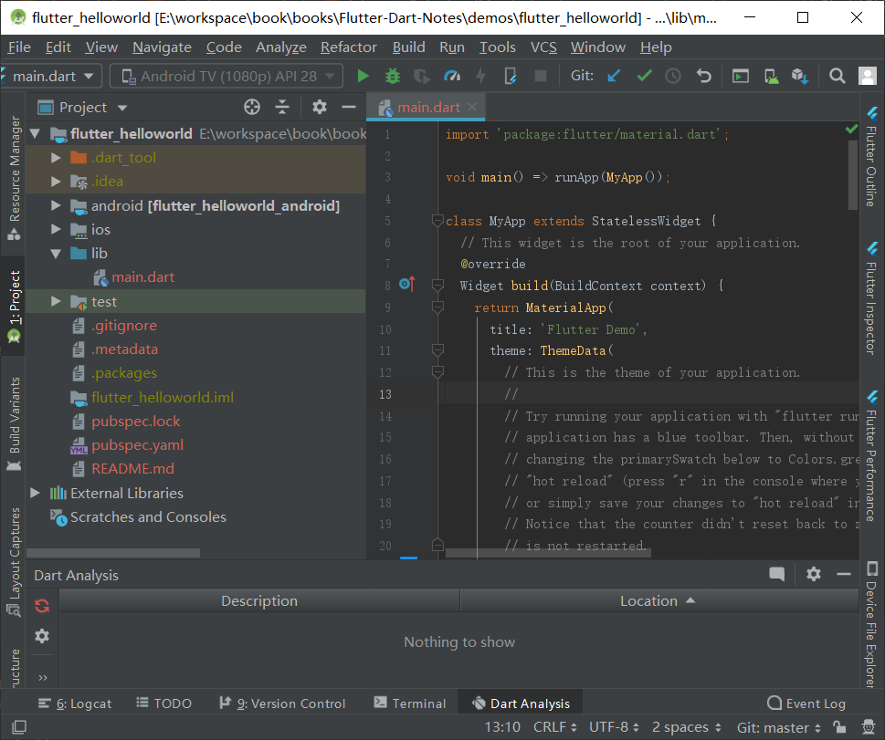

# Flutter初体验之Helloworld

命令行创建一个flutter：

``` bash
> flutter create flutter_helloworld
...
All done!
```

直到出现`All done!`就算创建完成了。

有关flutter命令参见flutter[常用命令行](04.环境搭建.html#常用命令行)。

## VSCode

> 使用VSCode开发Flutter项目，需要安装Flutter和Dart插件。
>
> 

使用VSCode打开上面创建的项目。项目目录结构如下：



新建Flutter项目的结构和原生android的工程结构不一样，我们不能用android那种多module 多lib的结构去创建module和lib，因为我们的代码都是在lib目录里面完成的，除非要用到原生交互的代码，你可以在android目录里面去写，然后在lib目录里面去引用这些交互的代码。
- android目录
   这里存放的是Flutter与android原生交互的一些代码，这个路径的文件和创建单独的Android项目的基本一样的。不过里面的代码配置跟单独创建Android项目有些不一样。
   
- ios目录

   这里存放的是Flutter与ios原生交互的一些代码。

- lib目录

  这里存放的是Dart语言编写的代码，这里是核心代码。不管是Android平台，还是ios平台，安装配置好环境，可以把dart代码运行到对应的设备或模拟器上面。刚才的示例中，就是运行的lib目录下的main.dart这个文件。
   我们可以在这个lib目录下面创建不同的文件夹，里面存放不同的文件，使用Dart语言写我们的自己的代码。

- pubspec.yaml文件

  这个是配置依赖项的文件，比如配置远程pub仓库的依赖库，或者指定本地资源（图片、字体、音频、视频等）。

运行一下，命令行输入：

``` bash
$ flutter devices
1 connected device:

Android SDK built for x86 • emulator-5554 • android-x86 • Android 10 (API 29)(emulator)
```

先查看下有哪些可用的接入设备，我这里只有一个Android 模拟器。

再执行:

``` bash
$ flutter run android
Target file "android" not found.
```

提示`android`找不到，换命令：

``` bash
$ flutter run -d android
```

以debug模式安装，会使用gradle对项目进行编译，时间会久一些，等待一会：

``` bash
$ flutter run -d android
Using hardware rendering with device Android SDK built for x86. If you get graphics artifacts, consider enabling software rendering with
"--enable-software-rendering".
Launching lib\main.dart on Android SDK built for x86 in debug mode...
Running Gradle task 'assembleDebug'...                                  
Running Gradle task 'assembleDebug'... Done                        26.3s
√ Built build\app\outputs\apk\debug\app-debug.apk.
Installing build\app\outputs\apk\app.apk...                         2.6s
D/EGL_emulation( 7619): eglMakeCurrent: 0xe051a120: ver 2 0 (tinfo 0xe050f8a0)
D/eglCodecCommon( 7619): setVertexArrayObject: set vao to 0 (0) 1 0     
I/OpenGLRenderer( 7619): Davey! duration=1197ms; Flags=1, IntendedVsync=2428479447490, Vsync=2428579447486, OldestInputEvent=9223372036854775807, NewestInputEvent=0, HandleInputStart=2428588419300, AnimationStart=2428588513100, PerformTraversalsStart=2428588587000, DrawStart=2429564324200, SyncQueued=2429566004200, SyncStart=2429570582700, IssueDrawCommandsStart=2429572194200, SwapBuffers=2429616863800, FrameCompleted=2429681068800, DequeueBufferDuration=14871000, QueueBufferDuration=1788000,
I/Choreographer( 7619): Skipped 64 frames!  The application may be doing too much work on its main thread.
D/EGL_emulation( 7619): eglMakeCurrent: 0xe051a420: ver 2 0 (tinfo 0xe050f800)
D/eglCodecCommon( 7619): setVertexArrayObject: set vao to 0 (0) 1 0     
Syncing files to device Android SDK built for x86...                    
10,960ms (!)

Flutter run key commands.
r Hot reload. ���
R Hot restart.
h Repeat this help message.
d Detach (terminate "flutter run" but leave application running).
c Clear the screen
q Quit (terminate the application on the device).
An Observatory debugger and profiler on Android SDK built for x86 is available at: http://127.0.0.1:11656/otuOFr4tKvE=/
```

运行结果：



## Android studio

> Android studio开发Flutter项目同样需要先安装Flutter和Dart插件：
>
> 

Android studio也可以直接导入上面创建的项目进行开发，也可以自己创建Flutter。

方便起见，直接导入上面的项目：



运行结果一样。


## 参考

- [Flutter项目结构目录分析](https://www.jianshu.com/p/759d26c9fcc7)