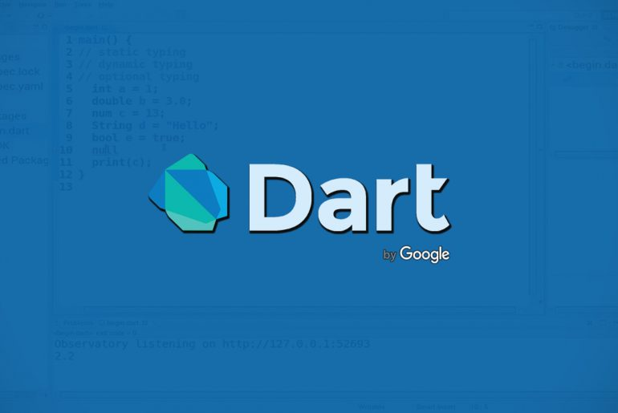

# 导言

## Dart介绍

Dart是由谷歌开发的计算机编程语言，可以用于web、服务器、移动应用和物联网等领域。

Dart诞生于2011年，号称要取代JavaScript，但一直不温不火，不被人重视。直到Flutter出现，才又重新得到赏识。

Dart是Flutter的开发语言，因此要学会Flutter，首先要学会Dart。

dart 官网:[https://dart.dev/](https://dart.dev/)

相关链接：

- [dart 官网](https://dart.dev/) [guides](https://dart.dev/guides) [github](https://github.com/dart-lang/)
- [Dart 编程语言中文网 | Dart](https://www.dartcn.com/)
- [Dart | Dart语言中文社区](http://www.cndartlang.com/dart)